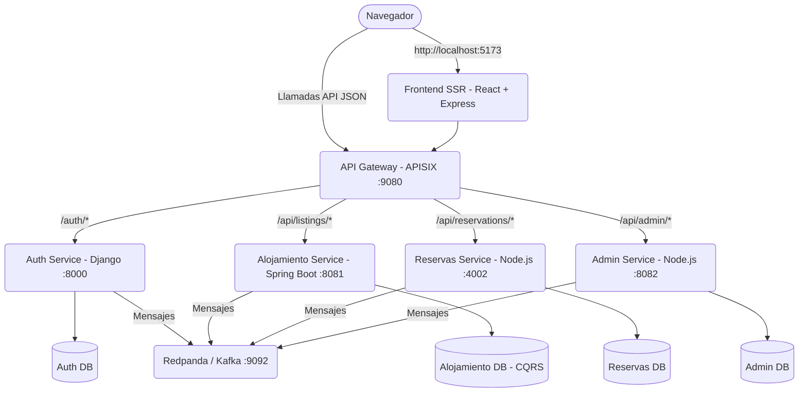

# 🏠 AlojateYa (StayBnb)

Plataforma de alojamientos estilo Airbnb con arquitectura de microservicios, API Gateway y frontend con Server-Side Rendering (SSR).

---

## 📐 Arquitectura del Sistema



---

## 🚀 Requisitos y Despliegue

| Herramienta | Versión mínima |
|-------------|----------------|
| **Docker** | 24+ |
| **Docker Compose** | 2.20+ |
| **Git** | 2.30+ |

> [!NOTE]
> No necesitas instalar Node.js, Python, Java ni PostgreSQL en tu máquina host. Toda la infraestructura está contenida en Docker.

### 1. Levantar el proyecto

1. **Clonar el repositorio:**
   ```bash
   git clone https://github.com/Alienbooy/Airbnb-cf.git
   cd Airbnb-cf
   ```

2. **Levantar los servicios con Docker Compose:**
   ```bash
   docker-compose up -d
   ```

### 2. Verificar los servicios

Puedes revisar el estado de los contenedores usando `docker-compose ps`.
El frontend compila automáticamente. Puedes seguir su progreso usando `docker logs frontend -f`.

**El servicio estará disponible en [http://localhost:5173](http://localhost:5173)**.

---

## ⚡ Server-Side Rendering (SSR)

El frontend implementa SSR puro con React y Express para mejorar la carga inicial y el SEO.
1. La primera petición renderiza un HTML completo y estático (títulos, imágenes) en milisegundos.
2. Al descargar `entry-client.js` en segundo plano, React realiza una "hidratación" sin causar destellos en la interfaz.
3. Se integran hooks personalizados y contextos (como `AuthContext`) compatibles con entornos isomorfos.

---

## 📂 Estructura del Proyecto

```
Airbnb-cf/
├── conf/                          # Configuración de APISIX Gateway
│   ├── config.yaml
│   └── apisix.yaml                # Rutas y upstreams declarativos
│
├── frontend/                      # App React 18 + Vite SSR + Express Server
│
├── services/
│   ├── auth-prueba/               # Microservicio Auth (Django REST + JWT)
│   ├── alojamientos/              # Microservicio Alojamientos (Spring Boot + CQRS)
│   ├── reservas-service/          # Microservicio Reservas (Node.js/Express)
│   └── admin-reportes/            # Microservicio Admin (Node.js/Express)
│
└── docker-compose.yml             # Orquestación de infraestructura
```

---

## 🛣️ Rutas del API Gateway

El API Gateway centraliza las llamadas y enruta el tráfico basándose en reglas y prioridad. Las rutas protegidas (como `/api/listings` o `/api/admin`) incluyen verificación y redirección de `forward-auth` conectada a `auth_service`.

| Endpoint | Destino | Propósito |
|----------|---------|-----------|
| `/api/auth/*` | `auth_service:8000` | Login, Registro y Verificación |
| `/api/listings/*` | `alojamientos_service:8081` | Catálogo y creación de alojamientos |
| `/api/admin/*` | `admin_service:8082` | Moderación de listados |
| `/api/reservations/*` | `reservations-service:4002` | CRUD de reservas |
| `/api/*` | `auth_service:8000` | Ruta base (catch-all de API) |
| `/*` | `frontend:5173` | Frontend SSR (Vistas) |

---

## 👥 Roles y Permisos

| Rol | Privilegios |
|-----|-------------|
| **client** | Inicio, búsqueda, visualizar detalle, reservar, ver sus viajes. |
| **host** | Dashboard, publicación de propiedades, edición de alojamientos. |
| **admin** | Panel de control global, moderación y logs de auditoría (Aprobar/Rechazar). |

---

## 📄 Licencia
Uso privado — Fines educativos y de aprendizaje en arquitecturas modernas y escalabilidad.
